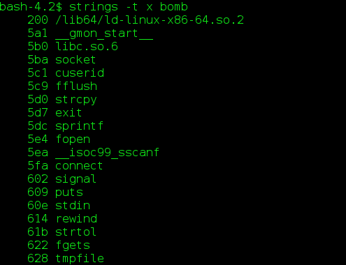
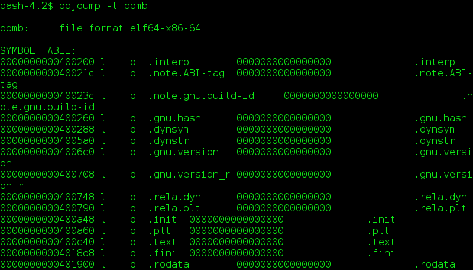
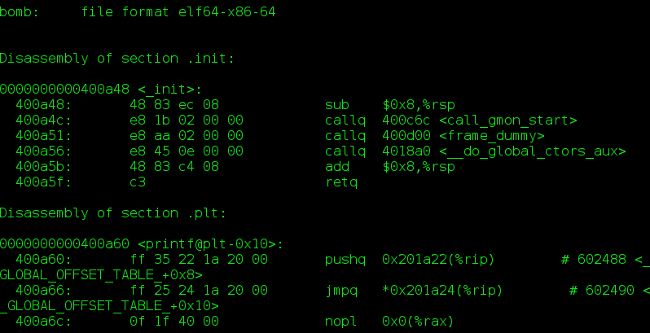
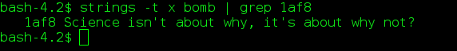
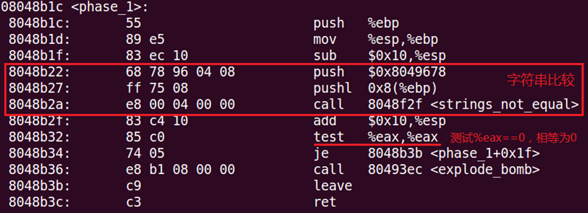
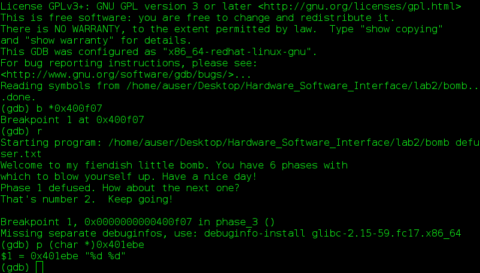
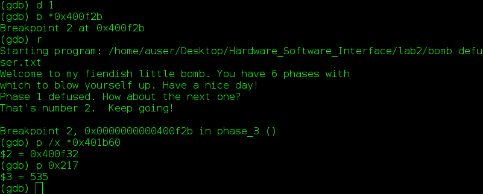
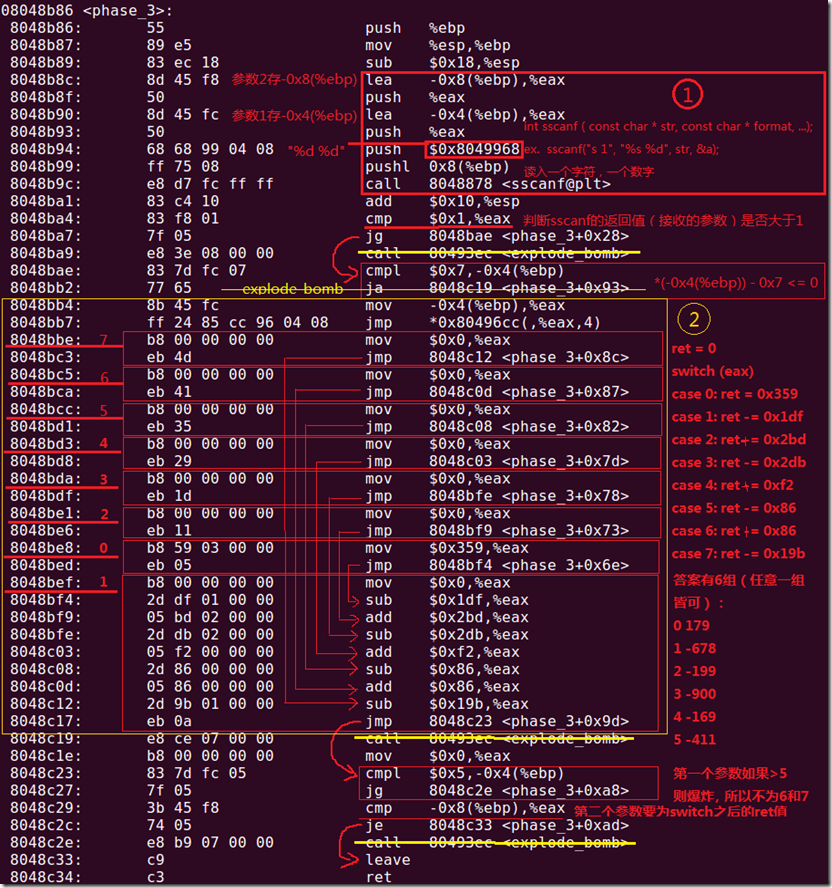
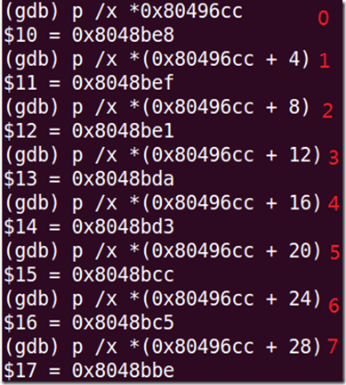

Hardware_Software_Interface
===========================

###The program assignments of the class [Hardware/Software Interface](https://www.coursera.org/course/hwswinterface) on Coursera.

>
* Lab 0: Warm Up
  * 纯属热身
  * 基本的C语言操作
* Lab 1: Manipulating Bits Using C
  * 用位运算解决一系列问题，而且有字符数限制
  * 一些基本的数理逻辑，例如德摩根率(De Morgan's law)
* Lab 2: Disassembling and Defusing a Binary Bomb
  * 传说中的二进制炸弹
  * 各种GDB，打各种断点，查看各种寄存器内存状态，分析汇编语句，整理出结构
  * 熟悉操作系统的调用过程
  * 这个Lab是整门课最精彩的Lab
* Lab 3: Buffer Overflows and Segmentation fault
  * 传说中的缓冲区溢出攻击
  * 利用内存溢出的漏洞去攻击给你提供的可执行程序
  * 最邪恶的Lab没有之一
* Lab 4: Cache Geometries
  * 不透明的Cache，类似于Lab2的黑箱Lab
  * 逆向工程破解一个CPU的构造，通过给几个虚拟的Cache提供输入，以及Cache给你返回的Hit/Miss信息判断Cache的规格
  * 对了解Cache的结构很有帮助
* Lab 5: Writing a Dynamic Storage Allocator
  * 手写一个malloc
  * 靠！

Reference Book
--------------
[Computer Systems: A Programmer’s Perspective, 2nd Edition (CS:APP)](http://csapp.cs.cmu.edu/)

Notes
-----
####Lab1
isPower2()这个想了好久，没办法最后还是上网搜了，学习的是思路，然后自己将逻辑再优化一下，将op数减少到9个。不知道还能不能再少？
```c
bits.c
/*
 * isPower2 - returns 1 if x is a power of 2, and 0 otherwise
 *   Examples: isPower2(5) = 0, isPower2(8) = 1, isPower2(0) = 0
 *   Note that no negative number is a power of 2.
 *   Legal ops: ! ~ & ^ | + << >>
 *   Max ops: 20
 *   Rating: 4
 */
int isPower2(int x) {
 return !(!x|x>>31 | x&x+~0);
}
```
相对来说，经过之前各种位操作的折磨洗礼后，再看pointer这个就显得比较简单了。同样是最后一题，会发现容易很多。
```c
pointer.c
/*
 * Return x with the n bits that begin at position p inverted (i.e.,
 * turn 0 into 1 and vice versa) and the rest left unchanged. Consider
 * the indices of x to begin with the low-order bit numbered as 0.
 */
int invert(int x, int p, int n) {
	// TODO
	int mask=1<<31>>32+~(p+n) ^ ~0<<p;
	return x^mask;
}
```
注：不要吐槽括号少，因为操作数优先级的缘故，括号能省就省了。

####Lab2
我能说，我看汇编代码看的确实捉急，奈何功力尚浅有表示膜拜大神，搜索不是我的本意但我还是拼尽全力，学到了很多一言难尽彻夜难眠啊，故此lab详细记录。
这里就用官方文档推荐的三个工具：
>
* gdb
* objdump
* strings
当然你也可以使用xxd，hexdump，ndisasm，高大上的ida等其他工具啦。

#####0x00 Bomb
先让我们对bomb这个可执行文件来个整体认识。<br>
运行：


显示文件中的可打印字符<br>
`strings -t x bomb`



输出目标文件的符号表<br>
`objdump -t bomb`



反汇编指令机器码的section<br>
`objdump -d bomb`



从反汇编代码中就可以看到我们要解决的就是6个phase。

#####0x01 Defuse
`Phase 1`<br>
先看phase1的反汇编代码：
```asm
0000000000400e70 <phase_1>:
  400e70:	48 83 ec 08          	sub    $0x8,%rsp
  400e74:	be f8 1a 40 00       	mov    $0x401af8,%esi
  400e79:	e8 bf 03 00 00       	callq  40123d <strings_not_equal>
  400e7e:	85 c0                	test   %eax,%eax
  400e80:	74 05                	je     400e87 <phase_1+0x17>
  400e82:	e8 b6 07 00 00       	callq  40163d <explode_bomb>
  400e87:	48 83 c4 08          	add    $0x8,%rsp
  400e8b:	c3                   	retq   
```
从上面汇编代码可以看到`400e79`处调用了函数`<strings_not_equal>`，看名字就知道该函数作用就是判断字符串是否相等。
如果不相等则调用`<explode_bomb>`函数引爆bomb，所以我们往上找传递的参数，`400e74`处的`mov $0x401af8,%esi`显然传入的就是要对比的字符串。
并且还是硬编码到代码里，所以直接`strings -t x bomb | grep 1af8`就出来了。

下图是cmu的bomb反汇编代码，稍许不同，整体一样。因为图上注释的比较详细，故引用于此。


`Phase 2`<br>
呃，好吧，代码变长了。
```asm
0000000000400e8c <phase_2>:
  400e8c:	48 89 5c 24 e0       	mov    %rbx,-0x20(%rsp)
  400e91:	48 89 6c 24 e8       	mov    %rbp,-0x18(%rsp)
  400e96:	4c 89 64 24 f0       	mov    %r12,-0x10(%rsp)
  400e9b:	4c 89 6c 24 f8       	mov    %r13,-0x8(%rsp)
  400ea0:	48 83 ec 48          	sub    $0x48,%rsp
  400ea4:	48 89 e6             	mov    %rsp,%rsi
  400ea7:	e8 97 08 00 00       	callq  401743 <read_six_numbers>
  400eac:	48 89 e5             	mov    %rsp,%rbp
  400eaf:	4c 8d 6c 24 0c       	lea    0xc(%rsp),%r13
  400eb4:	41 bc 00 00 00 00    	mov    $0x0,%r12d
  400eba:	48 89 eb             	mov    %rbp,%rbx
  400ebd:	8b 45 0c             	mov    0xc(%rbp),%eax
  400ec0:	39 45 00             	cmp    %eax,0x0(%rbp)
  400ec3:	74 05                	je     400eca <phase_2+0x3e>
  400ec5:	e8 73 07 00 00       	callq  40163d <explode_bomb>
  400eca:	44 03 23             	add    (%rbx),%r12d
  400ecd:	48 83 c5 04          	add    $0x4,%rbp
  400ed1:	4c 39 ed             	cmp    %r13,%rbp
  400ed4:	75 e4                	jne    400eba <phase_2+0x2e>
  400ed6:	45 85 e4             	test   %r12d,%r12d
  400ed9:	75 05                	jne    400ee0 <phase_2+0x54>
  400edb:	e8 5d 07 00 00       	callq  40163d <explode_bomb>
  400ee0:	48 8b 5c 24 28       	mov    0x28(%rsp),%rbx
  400ee5:	48 8b 6c 24 30       	mov    0x30(%rsp),%rbp
  400eea:	4c 8b 64 24 38       	mov    0x38(%rsp),%r12
  400eef:	4c 8b 6c 24 40       	mov    0x40(%rsp),%r13
  400ef4:	48 83 c4 48          	add    $0x48,%rsp
  400ef8:	c3                   	retq   
```
这关的hint是loops。看不出来循环体，没事，我们慢慢来。
一开始的都是一些传递参数的操作，这个先不管。
到了`400ea7`处调用`<read_six_numbers>`函数，看这个也就知道了我们要输入六个数字。
接下来再看循环体，往回jmp的就是循环体。
```
  400eba:	48 89 eb             	mov    %rbp,%rbx
  400ebd:	8b 45 0c             	mov    0xc(%rbp),%eax
  400ec0:	39 45 00             	cmp    %eax,0x0(%rbp)
  400ec3:	74 05                	je     400eca <phase_2+0x3e>
  400ec5:	e8 73 07 00 00       	callq  40163d <explode_bomb>
  400eca:	44 03 23             	add    (%rbx),%r12d
  400ecd:	48 83 c5 04          	add    $0x4,%rbp
  400ed1:	4c 39 ed             	cmp    %r13,%rbp
  400ed4:	75 e4                	jne    400eba <phase_2+0x2e>
```
每次%rbp加4，然后判断%r13和%rbp是否相等，不等跳回去。
回过头来看看%r13和%rbp分别是什么，在`400eac`和`400eaf`，%rbp=%rsp，%r13=%rsp+0xc，两者相差12,每次加4,是不是想到了什么。
六个数，1和3,2和4,3和6比较是否相等。简单吧。


`Phase 3`<br>
是不是瞬间眼花了，真是越来越长了。不过粗略一看也能看出个所以然来，这么多这么整齐的jmp，没错，就是switch statements。
```asm
0000000000400ef9 <phase_3>:
  400ef9:	48 83 ec 18          	sub    $0x18,%rsp
  400efd:	48 8d 4c 24 08       	lea    0x8(%rsp),%rcx
  400f02:	48 8d 54 24 0c       	lea    0xc(%rsp),%rdx
  400f07:	be be 1e 40 00       	mov    $0x401ebe,%esi
  400f0c:	b8 00 00 00 00       	mov    $0x0,%eax
  400f11:	e8 9a fb ff ff       	callq  400ab0 <__isoc99_sscanf@plt>
  400f16:	83 f8 01             	cmp    $0x1,%eax
  400f19:	7f 05                	jg     400f20 <phase_3+0x27>
  400f1b:	e8 1d 07 00 00       	callq  40163d <explode_bomb>
  400f20:	83 7c 24 0c 07       	cmpl   $0x7,0xc(%rsp)
  400f25:	77 3c                	ja     400f63 <phase_3+0x6a>
  400f27:	8b 44 24 0c          	mov    0xc(%rsp),%eax
  400f2b:	ff 24 c5 60 1b 40 00 	jmpq   *0x401b60(,%rax,8)
  400f32:	b8 17 02 00 00       	mov    $0x217,%eax
  400f37:	eb 3b                	jmp    400f74 <phase_3+0x7b>
  400f39:	b8 d6 00 00 00       	mov    $0xd6,%eax
  400f3e:	eb 34                	jmp    400f74 <phase_3+0x7b>
  400f40:	b8 53 01 00 00       	mov    $0x153,%eax
  400f45:	eb 2d                	jmp    400f74 <phase_3+0x7b>
  400f47:	b8 77 00 00 00       	mov    $0x77,%eax
  400f4c:	eb 26                	jmp    400f74 <phase_3+0x7b>
  400f4e:	b8 60 01 00 00       	mov    $0x160,%eax
  400f53:	eb 1f                	jmp    400f74 <phase_3+0x7b>
  400f55:	b8 97 03 00 00       	mov    $0x397,%eax
  400f5a:	eb 18                	jmp    400f74 <phase_3+0x7b>
  400f5c:	b8 9c 01 00 00       	mov    $0x19c,%eax
  400f61:	eb 11                	jmp    400f74 <phase_3+0x7b>
  400f63:	e8 d5 06 00 00       	callq  40163d <explode_bomb>
  400f68:	b8 00 00 00 00       	mov    $0x0,%eax
  400f6d:	eb 05                	jmp    400f74 <phase_3+0x7b>
  400f6f:	b8 9e 03 00 00       	mov    $0x39e,%eax
  400f74:	3b 44 24 08          	cmp    0x8(%rsp),%eax
  400f78:	74 05                	je     400f7f <phase_3+0x86>
  400f7a:	e8 be 06 00 00       	callq  40163d <explode_bomb>
  400f7f:	48 83 c4 18          	add    $0x18,%rsp
  400f83:	c3                   	retq   
```
这次我们开始使用神器了，gdb一下，你会发现，轻松许多。使用之前，先大致浏览一下代码整体结构。
首先`400f11`处调用了一个系统函数`sscanf`。（不了解就man一下，反正跟scanf差不多，格式化读入。）
然后比较读入数据的个数是否大于1,是就跳转，不然爆炸。
`400f20`，与7比较大小。
`400f2b`，此处是关键，这里是一个switch跳转表，根据%rax的不同往不同地址跳。
再下面就是跳转分支了。
最后，在`400f74`有一个比较，缘由后解。
打开gdb：`gdb --args bomb defuser.txt`
目测`0x401ebe`为参数，先在`400f07`处设置断点，查看输入格式。

可以看到要求输入两个数字。其中第一个数字要小于7,第二个数字需要等于返回值%eax，这个自己看代码。
这次我们在`400f2b`设断点，并将第一个数字设为0,看跳转到哪里，跟踪获取%eax的值。

当第一个数字为0时，`*0x401b60`指向地址`0x400f32`处，也就是跳转到该处，查看代码，`mov $0x217,%eax`，一个赋值，然后就跳转结束了。
可以得知，输入`0 535`通关。当然其它的情况你可以自己尝试。
下图是详细的程序流程：

switch跳转表：



`Phase 4`<br>

写在最后
--------
我只能说，这课和吴恩达的机器学习，号称C站上的两大神课。

注明：
本文中有部分图片出自他人博客，也参考了其内容，原文看[这里](http://www.cnblogs.com/remlostime/archive/2011/05/21/2052708.html)
转载本文请注明出处，尊重作者的劳动，谢谢。